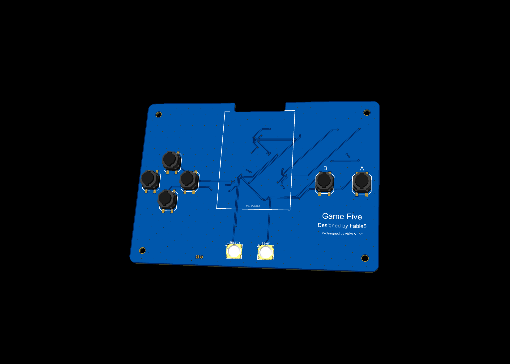
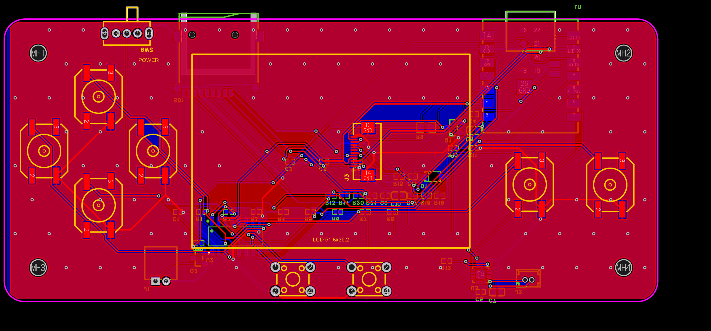

# Game Five

**XIAO ESP32-S3 ベースの携帯ゲーム機 / A handheld game console based on Seeed XIAO ESP32-S3**

Game Five is an open-source handheld game console PCB + 3D-printable enclosure, designed around the Seeed Studio **XIAO ESP32-S3** and a 2.0-inch **HS20HS072RX** (ST7789, 240×320, SPI) TFT display. All parts were selected to be in stock at JLCPCB for turnkey PCBA.

Seeed Studio XIAO ESP32-S3 と 2.0インチTFT液晶(HS20HS072RX, ST7789, 240×320, SPI)を使った携帯ゲーム機です。基板(JLCPCB PCBA対応)と3Dプリントケースの設計データを公開しています。

## Features / 特徴

- **MCU**: Seeed XIAO ESP32-S3 (Wi-Fi / BLE, USB-C, LiPo充電回路内蔵)
- **Display**: HS20HS072RX 2.0" TFT 240×320, ST7789, 4-wire SPI (LCSC **C5329582**)
- **Controls**: 十字キー + A/B (Panasonic EVQQ1D06M 丸ボタン) + SELECT/START (小型タクト)
- **Audio**: MAX98357A I2S アンプ + 8Ω スピーカ (JST PH2.0)
- **Power**: LiPo バッテリ (JST PH2.0) → XIAO の BAT± パッドに直結(充電は XIAO 内蔵回路)
- **Buttons via 74HC165**: XIAO の GPIO 11 本で LCD + 8 ボタン + 音声 + バックライト PWM を実現するため、8 ボタンはシフトレジスタ **74HC165** で SPI 読み取り
- **PCB**: 120 × 85 mm, 2層, 両面 GND ベタ + スティッチングビア ~325個, DRC クリーン
- **FPC notch**: 基板上辺に 26 mm 幅の切り欠き(凹形状)— 液晶の FPC はモジュール上端で折り返し、切り欠きを通って裏面のコネクタ (J3) に挿します
- **Enclosure**: 2ピース 3D プリントケース(下トレイ + 上蓋)。十字キーは十字型カット、液晶部はクリア窓アイランド

## Repository contents / 収録データ

| Path | Contents |
|---|---|
| `fab/GameFive_Gerber.zip` | 製造用ガーバー (JLCPCB 2層) |
| `fab/GameFive_BOM.xlsx` | BOM (LCSC 部品番号付き, JLCPCB PCBA 用) |
| `fab/GameFive_PickAndPlace.xlsx` | 実装座標データ |
| `case/GameFive_Case_Bottom.stl` | ケース下トレイ (3Dプリント用) |
| `case/GameFive_Case_Top.stl` | ケース上蓋 (クリア材推奨) |
| `case/GameFive_Case_Assembly.step` | ケース組立 STEP |
| `case/case_rebuild_fusion360.py` | Fusion 360 API 用ケース生成スクリプト (パラメトリック再生成) |
| `easyeda/GameFive.epro` | **EasyEDA Pro プロジェクトファイル**(回路図 + PCB ソース) — EasyEDA Pro の File → Open で開けます |
| `images/` | 基板レンダリング |

## Pin map / ピンアサイン

| XIAO pin | GPIO | Function |
|---|---|---|
| D0 | GPIO1 | LCD CS |
| D1 | GPIO2 | LCD DC (RS) |
| D2 | GPIO3 | LCD RST |
| D3 | GPIO4 | 74HC165 LATCH (SH/LD#) |
| D4 | GPIO5 | Backlight PWM (SI2302 low-side) |
| D5 | GPIO6 | I2S BCLK (MAX98357A) |
| D6 | GPIO43 | I2S LRCLK |
| D7 | GPIO44 | I2S DIN |
| D8 | GPIO7 | SPI SCK (LCD + 74HC165 共有) |
| D9 | GPIO8 | SPI MISO (74HC165 QH) |
| D10 | GPIO9 | SPI MOSI (LCD SDA) |

74HC165 inputs: A=UP, B=DOWN, C=LEFT, D=RIGHT, E=A, F=B, G=START, H=SELECT (10 kΩ pull-up, active-low)

## Display connection / 液晶の接続

- LCD FPC はモジュール**上端で折り返し**、基板上辺の切り欠き(幅26 mm)を通して**裏面の FPC コネクタ J3**(XKB X05A20L12T, 12P 0.5 mm 下接点フリップ)に挿入します
- 折り返しにより左右が反転するため、**J3 のピン割当は液晶ピンの逆順**(J3 pin n = LCD pin 13−n)で配線済みです
- 基板シルクの枠線(51.8 × 36.2 mm)が液晶モジュールの貼り付け位置ガイドです
- 液晶本体 (C5329582) は BOM に含まれません — **別途購入**してください

## Ordering / 発注メモ (JLCPCB)

1. `fab/GameFive_Gerber.zip` をアップロード(2層, 1.6 mm, 任意の色)
2. PCBA: `GameFive_BOM.xlsx` + `GameFive_PickAndPlace.xlsx` をアップロード
3. **U1 (XIAO ESP32-S3) は JLC 在庫が常時ゼロ**のため、部品支給 (consign) にするか、DNP にして手はんだしてください
4. **J1 (バッテリコネクタ, THT)** は Economic PCBA 対象外 — Standard PCBA か手はんだ
5. 液晶 HS20HS072RX (C5329582) と LiPo バッテリ、8Ω スピーカは別途購入
6. ケースは STL を 3D プリント(上蓋はクリアレジン/フィラメント推奨)。M2.5 ネジ4本で固定

## License / ライセンス

This project is licensed under the **CERN Open Hardware Licence Version 2 – Permissive (CERN-OHL-P-2.0)**.
See [LICENSE](LICENSE) for the full text.

本プロジェクトは **CERN-OHL-P-2.0** で公開されています。商用利用・改変・再配布可(ライセンス表示を保持してください)。

## Credits

- Designed by **Fable 5** (Claude, Anthropic)
- Co-designed by **Akira & Tom**
